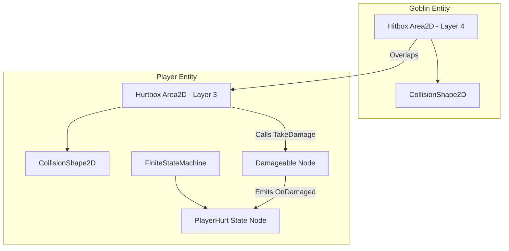

## Context

The player and enemies currently interact solely through physical kinematic body collisions. There are no combat layers, health pools, hit reaction states, or damage transmission mechanisms. This design establishes the foundational combat and trait architecture using Godot 4 node composition and C# (.NET 8).

See `proposal.md` for motivation and `specs/` for behavioral requirements.

## Goals / Non-Goals

**Goals:**
- Implement reusable, decoupled `Damageable`, `Hitbox`, and `Hurtbox` nodes.
- Implement structured `Hit` passing (damage amount, force, hit origin).
- Implement the `PlayerHurt` state in the player's `FiniteStateMachine` with directional knockback, hitstun, and visual sprite blinking.
- Configure Godot 2D collision layers for combat interaction.
- Wire `Goblin.tscn` with a `Hitbox` and `Player.tscn` with `Hurtbox` and `Damageable` to verify end-to-end combat.

**Non-Goals:**
- UI HUD hearts display (handled in Issue #29).
- Persistent save-statue checkpoints and save serialization (handled in Issue #28).
- Complex enemy AI attack patterns (handled in future combat/enemy changes).

## Decisions

### Decision 1: Concrete `Damageable` Node vs Interface / Component Suffix
* **Decision**: Create a single concrete `Damageable : Node` class without the `-Component` suffix or `IDamageable` interface.
* **Rationale**: Godot 4's composition model treats custom nodes as first-class citizens. Concrete nodes integrate seamlessly with Godot's `[Export]` inspector system without reflection overhead, and `Damageable` serves equally well for player HP, enemy HP, and destructible props.
* **Alternatives Considered**: 
  - `HealthComponent` (verbose and restricted to living actors).
  - `IDamageable` interface (Godot's Inspector cannot export C# interfaces directly).

### Decision 2: `Hit` Struct for Strike Data
* **Decision**: Transmit hits via a `readonly struct Hit` containing `Damage`, `Origin`, and `Force`.
* **Rationale**: Combat in a 2D action game requires spatial context for directional knockback (`Origin`), magnitude (`Force`), and hit damage (`Damage`). The receiver decides how to apply `Force` (e.g. player applies knockback velocity, props scatter debris, heavy objects ignore it).
* **Alternatives Considered**: 
  - Passing separate arguments in method signatures (`TakeDamage(int damage, Vector2 origin, float force)`).
  - `DamagePayload` (overly verbose enterprise terminology).

### Decision 3: 2D Collision Layer Layout
* **Decision**: Dedicate specific 2D collision layers for combat detection:
  - Layer 1: World / Environment geometry (solid terrain)
  - Layer 2: One-way platforms
  - Layer 3: Player Hurtbox (Receiver)
  - Layer 4: Enemy Hitbox (Attacker / Contact damage)
  - Layer 5: Player Hitbox (Attacker / Sword, future weapons)
  - Layer 6: Enemy Hurtbox (Receiver)
* **Rationale**: Separating Hitboxes and Hurtboxes into distinct layers prevents friendly fire and avoids self-collision checks.

## Technical Architecture & Node Composition



### 1. `Hit` (`scripts/combat/Hit.cs`)
```csharp
public readonly struct Hit
{
    public int Damage { get; init; }
    public Vector2 Origin { get; init; }
    public float Force { get; init; }
}
```

### 2. `Damageable` (`scripts/nodes/Damageable.cs`)
- **Inherits**: `Godot.Node`
- **Exports**:
  - `[Export] public int MaxHitPoints { get; set; } = 6;`
  - `[Export] public int CurrentHitPoints { get; set; } = 6;`
- **Signals**:
  - `[Signal] public delegate void OnDamagedEventHandler(Hit hit);`
  - `[Signal] public delegate void OnHealthChangedEventHandler(int current, int max);`
  - `[Signal] public delegate void OnDepletedEventHandler();`
- **Methods**:
  - `public void TakeDamage(Hit hit)`
  - `public void Heal(int amount)`

### 3. `Hurtbox` (`scripts/nodes/Hurtbox.cs`)
- **Inherits**: `Godot.Area2D`
- **Exports**:
  - `[Export] private Damageable _damageable;`
- **Properties**:
  - `public bool IsInvulnerable { get; set; } = false;`
- **Signals**:
  - `[Signal] public delegate void OnHurtEventHandler(Hit hit);`
- **Methods**:
  - `public void ReceiveHit(Hit hit)`: If not invulnerable, emits `OnHurt` and forwards hit to `_damageable?.TakeDamage(hit)`.

### 4. `Hitbox` (`scripts/nodes/Hitbox.cs`)
- **Inherits**: `Godot.Area2D`
- **Exports**:
  - `[Export] public int Damage { get; set; } = 1;`
  - `[Export] public float Force { get; set; } = 250f;`
- **Logic**:
  - Connects to `AreaEntered`. When overlapping a `Hurtbox`, constructs a `Hit` (`Damage = Damage`, `Origin = GlobalPosition`, `Force = Force`) and calls `hurtbox.ReceiveHit(hit)`.

### 5. `PlayerHurt` State (`scripts/entities/player/states/PlayerHurt.cs`)
- **Inherits**: `State`
- **Exports / Dependencies**:
  - `[ExportGroup("Dependencies")]`
  - `[Export] private CharacterBody2D _body;`
  - `[Export] private Damageable _damageable;`
  - `[Export] private Hurtbox _hurtbox;`
  - `[Export] private AnimatedSprite2D _sprite;`
  - `[Export] private AudioStreamPlayer2D _soundEffect;`
  - `[ExportGroup("Transitions")]`
  - `[Export] private State _standingState;`
  - `[Export] private State _fallingState;`
  - `[ExportGroup("Tuning")]`
  - `[Export] private float _hitstunDuration = 0.25f;`
  - `[Export] private float _invulnerabilityDuration = 1.2f;`
  - `[Export] private float _upwardKnockbackRatio = 0.5f;`
- **Lifecycle & Validation**:
  - `_Ready()`: Validates that all exported dependencies are assigned. If any are null, pushes an explicit error via `GD.PushError` to fail fast during scene setup.
  - `Enter()`: Enables `_hurtbox.IsInvulnerable = true`. Computes directional knockback:
    ```csharp
    float dirX = Mathf.Sign(_body.GlobalPosition.X - hit.Origin.X);
    if (dirX == 0) dirX = -Mathf.Sign(_sprite.Scale.X); // Fallback: knock away from facing direction

    _body.Velocity = new Vector2(
        dirX * hit.Force,
        -hit.Force * _upwardKnockbackRatio // Negative Y = Upward
    );
    ```
  - `UpdatePhysics()`: Applies gravity and horizontal deceleration. After `_hitstunDuration`, transitions to `_standingState` (if `IsOnFloor()`) or `_fallingState`.
  - In background, handles sprite alpha blinking timer until `_invulnerabilityDuration` completes, then sets `_hurtbox.IsInvulnerable = false` and resets sprite visibility.

## Risks / Trade-offs

- **[Risk: Stuck in hitstun when taking simultaneous hits]** $\rightarrow$ *Mitigation*: Setting `_hurtbox.IsInvulnerable = true` immediately upon taking damage guarantees no overlapping hitboxes can trigger concurrent damage during the recovery window.
- **[Risk: Missing node wiring in Inspector]** $\rightarrow$ *Mitigation*: In `_Ready()`, `Hurtbox` and `PlayerHurt` perform strict `null` checks and log descriptive errors via `GD.PushError` to ensure misconfigured scenes fail fast and visibly in the Godot debugger.
